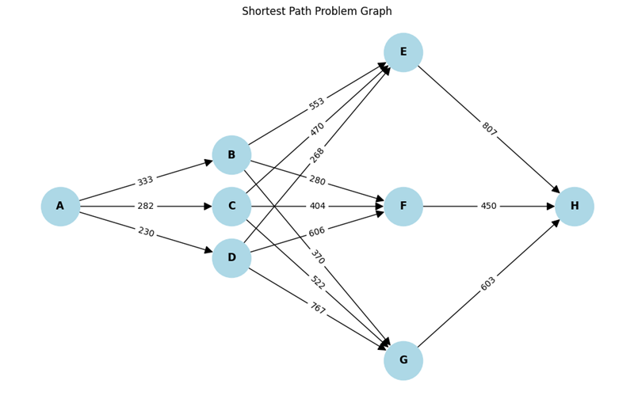
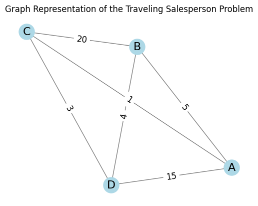

# Shortest Path & Traveling Salesperson Problems
## Deterministic Dynamic Programming

## Overview

This project explores solutions to the Shortest Path Problem (SPP) and the Traveling Salesperson Problem (TSP) using deterministic dynamic programming. It involves finding the shortest path between cities with specified energy costs and determining the optimal sequence for visiting multiple cities in TSP scenarios.

## Project Structure

```markdown
your-repo-name/
│
├── README.md                                      # Project overview and instructions
├── Practical_Deterministic_Dynamic_Programming.ipynb  # Jupyter notebook for solving SPP and TSP with detailed explanations
├── graph_shortest_path_problem.png                # Graphical representation of the Shortest Path Problem
├── graph_traveling_salesperson_problem.png        # Graphical representation of the Traveling Salesperson Problem
└── requirements.txt                               # Python dependencies
```


## Usage

1. **Open the Notebook:**
   - Run the Jupyter notebook to explore the deterministic dynamic programming solution for both SPP and TSP:
     ```bash
     jupyter notebook Practical_Deterministic_Dynamic_Programming.ipynb
     ```

2. **View Graphs:**
   - The images `graph_shortest_path_problem.png` and `graph_traveling_salesperson_problem.png` illustrate the SPP and TSP respectively.
  
</br>



</br>




## Key Concepts

- **Deterministic Dynamic Programming:** Used to calculate the least-cost paths in both the SPP and TSP scenarios.
- **Optimization of Travel Routes:** Applied to minimize the total energy cost or distance traveled across cities.


